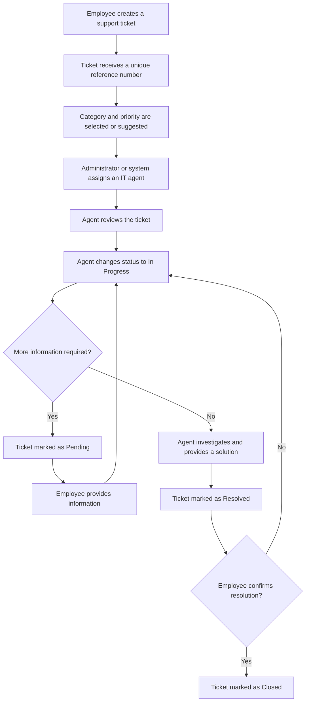
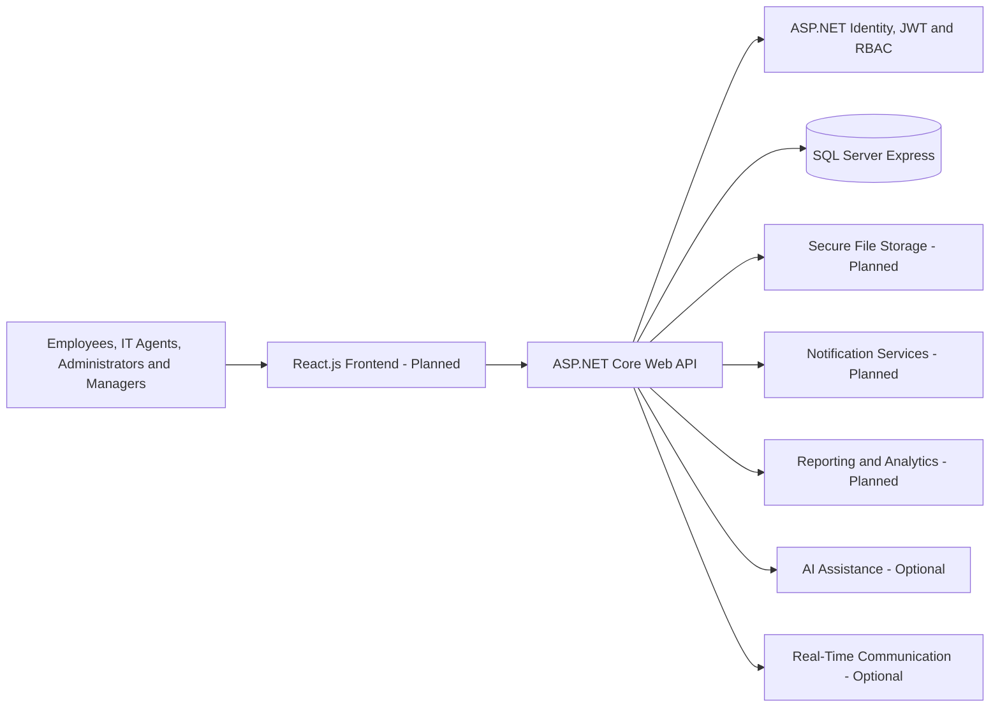

<div align="center">

# ResolveHub

### IT Help Desk & Ticketing Management System

**Create Tickets · Track Progress · Communicate · Get Resolved**

<br>


<br>

A modern full-stack platform for managing internal IT support requests through a centralized, secure, and structured ticketing workflow.

</div>

---

> [!IMPORTANT]
> **Current implementation status:** The ASP.NET Core backend authentication module is implemented and tested. It includes SQL Server integration, Entity Framework Core migrations, ASP.NET Core Identity, JWT authentication, protected API endpoints, role-based authorization, account lockout, seeded demo users, and Swagger testing.
>
> The React frontend and the remaining ticket-management modules will be implemented incrementally during the next development stages.

## Table of Contents

- [Overview](#overview)
- [Current Implementation](#current-implementation)
- [Assignment 3 — Authentication and Authorization](#assignment-3--authentication-and-authorization)
- [The Problem](#the-problem)
- [Project Objectives](#project-objectives)
- [User Roles](#user-roles)
- [Core Features](#core-features)
- [Ticket Workflow](#ticket-workflow)
- [Technology Stack](#technology-stack)
- [System Architecture](#system-architecture)
- [Database Overview](#database-overview)
- [Authentication API Endpoints](#authentication-api-endpoints)
- [API Testing Evidence](#api-testing-evidence)
- [Documentation](#documentation)
- [Quality Requirements](#quality-requirements)
- [Getting Started](#getting-started)
- [Demo Accounts](#demo-accounts)
- [Project Roadmap](#project-roadmap)
- [License](#license)
- [Author](#author)

---

## Overview

**ResolveHub** is a web-based IT Help Desk and Ticketing Management System designed to help organizations manage internal technical support requests efficiently.

Employees will be able to submit support tickets, attach supporting files, track progress, communicate with IT support agents, and receive updates until their issues are resolved.

IT support agents will be able to investigate assigned tickets, communicate with employees, update ticket statuses, add internal notes, escalate unresolved issues, and provide final solutions.

Administrators will manage users, roles, ticket categories, assignments, system settings, reports, and activity logs. Managers will monitor departmental support performance through dashboards and analytics.

---

## Current Implementation

The current implementation focuses on the secure backend foundation required before building the complete ticket-management system.

### Completed

- ASP.NET Core Web API project
- SQL Server database connection
- Entity Framework Core configuration
- Entity Framework Core migrations
- ASP.NET Core Identity integration
- Secure password hashing
- Email and password login
- JWT access-token generation
- 60-minute access-token lifetime
- JWT validation
- Protected API endpoints
- Role-Based Access Control (RBAC)
- Employee, IT Support Agent, Administrator, and Manager roles
- Account lockout after repeated failed login attempts
- Seeded roles and demo users
- OpenAPI and Swagger UI
- JWT authorization through Swagger
- Authentication and authorization testing
- Git and GitHub version control

### In Progress / Planned

- React frontend setup
- Login page connected to the backend API
- Frontend role-based navigation
- Complete ticket-management features
- Notifications, reporting, SLA tracking, assets, and knowledge base modules

---

## Assignment 3 — Authentication and Authorization

This stage of the project establishes the authentication and authorization foundation for ResolveHub.

### Assignment Objectives Covered

| Objective | Status |
|---|---:|
| Set up the ASP.NET Core backend project | Completed |
| Configure the SQL Server database connection | Completed |
| Implement authentication | Completed |
| Implement JWT authentication | Completed |
| Implement authorization | Completed |
| Implement role-based authorization | Completed |
| Configure database migrations | Completed |
| Test the APIs through Swagger | Completed |
| Set up the React frontend | Planned |
| Create and connect the login/index pages | Planned |

### Security Features Implemented

- ASP.NET Core Identity
- Secure password hashing
- JWT access tokens
- Token validation
- Role claims inside the JWT
- Protected routes using authorization attributes
- Role-restricted API endpoints
- `401 Unauthorized` handling
- `403 Forbidden` handling
- Account lockout with `423 Locked`
- Seeded development accounts for testing

---

## The Problem

Many organizations still handle technical support through:

- Scattered emails
- Phone calls
- Messaging applications
- Informal verbal requests
- Unstructured spreadsheets

This can result in:

- Lost or forgotten requests
- Slow response times
- Unclear responsibilities
- Poor communication
- Missing support history
- Limited performance monitoring

ResolveHub centralizes the complete support process into one organized platform where every request can be recorded, assigned, tracked, discussed, resolved, and reviewed.

---

## Project Objectives

ResolveHub aims to:

- Centralize internal IT support requests.
- Make ticket submission simple and accessible.
- Improve communication between employees and IT staff.
- Organize ticket assignment and reassignment.
- Prioritize urgent technical issues.
- Track every ticket from creation to closure.
- Reduce response and resolution delays.
- Preserve ticket history and audit information.
- Monitor service-level agreement deadlines.
- Provide useful dashboards, reports, and analytics.
- Support future automation using AI and real-time technologies.

---

## User Roles

| Role | Responsibilities |
|---|---|
| **Employee** | Creates tickets, uploads attachments, tracks progress, adds comments, receives notifications, reviews solutions, and confirms issue resolution. |
| **IT Support Agent** | Handles assigned tickets, investigates issues, communicates with employees, adds internal notes, updates statuses, escalates issues, and provides solutions. |
| **Administrator** | Manages users, roles, categories, priorities, statuses, assignments, reports, audit logs, settings, and overall system activity. |
| **Manager** | Monitors department tickets, unresolved issues, performance statistics, priority distribution, and authorized reports. |

---

## Core Features

### Authentication and User Management

#### Implemented

- Login using email and password
- Secure password hashing using ASP.NET Core Identity
- Password-strength requirements
- JWT access-token generation
- JWT validation
- 60-minute access-token expiration
- Role-Based Access Control
- Protected API routes
- Account lockout after repeated failed attempts
- Seeded roles and demo users
- Swagger JWT authorization

#### Planned

- User registration workflow
- Forgot-password functionality
- Password reset
- Refresh tokens
- User profile management
- Login and logout activity tracking
- Frontend login page and protected routes

### Ticket Management

- Create IT support tickets
- Generate a unique ticket reference number
- Add a title and detailed issue description
- Select ticket category and priority
- Upload screenshots, documents, and log files
- Edit eligible tickets
- Cancel unnecessary tickets
- Search and filter tickets
- Track creation and update dates
- Preserve the complete ticket history

### Ticket Categories

- Hardware
- Software
- Network
- Email
- Access Request
- Security
- Other

### Ticket Priorities 

| Priority | Purpose |
|---|---|
| **Low** | Minor issue with limited impact |
| **Medium** | Standard issue requiring attention |
| **High** | Important issue affecting productivity |
| **Critical** | Urgent issue with major operational impact |

### Ticket Statuses 

- Open
- Assigned
- In Progress
- Pending
- Resolved
- Closed
- Cancelled

### Assignment and Workflow 

- Manual assignment by administrators
- Optional automatic ticket assignment
- Ticket reassignment
- Assignment history
- Status updates by support agents
- Escalation for urgent or unresolved tickets
- Internal IT-only notes
- Complete audit trail of ticket actions

### Communication 

- Ticket comments
- Threaded replies
- Internal support notes
- `@username` mentions
- Employee-agent communication
- Notification center
- Real-time in-app notifications

### File Attachments 

- Upload screenshots, documents, and log files
- Validate file size and supported file types
- Store file metadata
- Secure file downloads
- Prevent unauthorized attachment access
- Link attachments to tickets, comments, or chat messages

### Dashboards 

#### Employee Dashboard

- Total submitted tickets
- Open tickets
- Tickets in progress
- Resolved tickets
- Recent notifications

#### IT Support Agent Dashboard

- Assigned tickets
- Tickets in progress
- Pending tickets
- High-priority tickets
- Critical tickets
- Resolved tickets
- Recent comments and updates

#### Administrator Dashboard

- Total ticket count
- Tickets by status, category, and priority
- Agent workload and performance
- Recent system activity
- Monthly ticket statistics

#### Manager Dashboard

- Department tickets
- Team ticket progress
- Common issue categories
- Unresolved and delayed tickets
- Monthly reports
- Priority distribution
- Employee support activity

### Reporting and Analytics

- Monthly ticket reports
- Tickets by category and priority
- Average resolution time
- Agent performance
- Employee activity
- Pending and delayed tickets
- SLA violation reports
- Charts and analytics
- PDF and CSV export

### SLA Management

- SLA policies based on ticket priority
- First-response deadlines
- Resolution deadlines
- Countdown timers
- Deadline warnings
- SLA violation tracking
- Agent and administrator alerts
- SLA status reporting

### Audit and Activity Logs 

- Login and logout tracking
- Ticket creation tracking
- Ticket assignment and reassignment tracking
- Ticket update and deletion tracking
- Administrative action tracking
- Entity and action details
- User, timestamp, IP address, and browser information

### AI-Assisted Features

- AI ticket categorization
- AI priority suggestions
- AI troubleshooting reply suggestions
- Duplicate-ticket detection
- AI ticket conversation summaries
- Confidence scoring
- Human review before accepting AI suggestions

### Real-Time Communication

- Employee-agent communication inside tickets
- Instant message delivery
- Typing indicators
- Online status
- Chat history
- File sharing
- Real-time message notifications

### QR Code Asset Management

- Register IT assets
- Generate a unique QR code for each asset
- Scan QR codes to view asset details
- Link support tickets to assets
- Track asset assignments
- Track maintenance and repair history
- Record warranties, locations, and asset status

### User Preferences 

- Light and dark theme preferences
- In-app notification preferences
- Personalized account settings

---

## Ticket Workflow



### Ticket Lifecycle

```text
Open → Assigned → In Progress → Pending → Resolved → Closed
```

A ticket may also be marked as **Cancelled** when the support request is no longer required.

---

## Technology Stack

| Area | Technology | Status |
|---|---|---:|
| **Frontend** | React.js | Planned |
| **Backend** | ASP.NET Core Web API | Implemented |
| **Database** | SQL Server Express | Implemented |
| **ORM** | Entity Framework Core | Implemented |
| **Identity** | ASP.NET Core Identity | Implemented |
| **Authentication** | JWT access tokens | Implemented |
| **Authorization** | Role-Based Access Control | Implemented |
| **API Documentation** | OpenAPI and Swagger UI | Implemented |
| **API Testing** | Swagger UI and Postman | Implemented |
| **UI/UX Design** | Figma | Completed for wireframes |
| **Database Design** | dbdiagram.io and Draw.io | Completed |
| **Version Control** | Git and GitHub | Implemented |
| **Documentation** | Markdown and PDF | Ongoing |

---

## System Architecture



The project follows a separated full-stack architecture:

1. The **React.js frontend** will provide the user interface.
2. The **ASP.NET Core Web API** handles authentication, authorization, business logic, and API communication.
3. **ASP.NET Core Identity, JWT, and RBAC** protect system resources.
4. **SQL Server Express** stores relational application data.
5. Future supporting services will handle notifications, attachments, reports, AI assistance, and real-time communication.

---

## Database Overview

ResolveHub uses SQL Server and Entity Framework Core.

### Currently Implemented Authentication Entities

| Entity | Purpose |
|---|---|
| `UserAccount` | Stores user identity, account, profile, and lockout information. |
| `Role` | Stores system roles. |
| `UserAccountRole` | Connects users to their assigned roles. |
| `Department` | Stores the departments associated with users. |

The repository includes Entity Framework Core migration files and an application database context snapshot. These files allow another developer to recreate the authentication database schema.

### Planned Full-System Database Areas

| Area | Main Entities |
|---|---|
| **Users and Security** | `UserAccount`, `Role`, `UserAccountRole`, `Department` |
| **Ticket Management** | `Ticket`, `TicketCategory`, `TicketPriority`, `TicketStatus` |
| **Workflow Tracking** | `TicketAssignment`, `TicketHistory`, `TicketEscalation` |
| **Communication** | `TicketComment`, `TicketMention`, `TicketChatMessage` |
| **Files and Notifications** | `TicketAttachment`, `Notification` |
| **SLA Management** | `SlaPolicy`, `TicketSlaTracking` |
| **Auditing** | `ActivityLog` |
| **Asset Management** | `Asset`, `AssetMaintenanceHistory` |
| **AI Assistance** | `AISuggestion` |
| **Preferences and Reports** | `UserPreference`, `ReportExport` |

---

## Authentication API Endpoints

| Method | Endpoint | Required Access |
|---|---|---|
| `POST` | `/api/auth/login` | Anonymous |
| `GET` | `/api/authorization-test/authenticated` | Any authenticated user |
| `GET` | `/api/authorization-test/employee` | Employee |
| `GET` | `/api/authorization-test/agent` | IT Support Agent |
| `GET` | `/api/authorization-test/admin` | Administrator |
| `GET` | `/api/authorization-test/manager` | Manager |

### Important Response Codes

| Code | Meaning |
|---:|---|
| `200 OK` | Login or authorized request completed successfully. |
| `401 Unauthorized` | The endpoint requires a valid JWT access token. |
| `403 Forbidden` | The authenticated user does not have the required role. |
| `423 Locked` | The account is temporarily locked after repeated failed login attempts. |

---

## API Testing Evidence

The API testing screenshots are stored inside:

```text
docs/api-testing-screenshots/
```

| Test | Expected Result | Evidence |
|---|---:|---|
| Successful login and JWT generation | `200 OK` | [View Screenshot](docs/api-testing-screenshots/Login_200_OK_JWT.png) |
| Protected endpoint without a token | `401 Unauthorized` | [View Screenshot](docs/api-testing-screenshots/Unauthorized_Access_401.png) |
| Account lockout after failed attempts | `423 Locked` | [View Screenshot](docs/api-testing-screenshots/Account_Lockout_423.png) |
| JWT configured successfully in Swagger | Authorized | [View Screenshot](docs/api-testing-screenshots/Swagger_JWT_Authorization.png) |
| Employee accessing an Administrator endpoint | `403 Forbidden` | [View Screenshot](docs/api-testing-screenshots/Role_Based_Authorization_403.png) |

The evidence above demonstrates successful authentication, JWT authorization, protected routes, role-based access control, and account lockout.

---

## Documentation

The following documentation and design artifacts are available in this repository.

| Document | Access | Description |
|---|---|---|
| **Project Overview** | **[View PDF](docs/project-overview/Project%20Overview.pdf)** | Defines the project purpose, scope, objectives, stakeholders, and overall system vision. |
| **Requirement Analysis** | **[View PDF](docs/requirement-analysis/Requirement%20analysis.pdf)** | Contains the functional and non-functional requirements. |
| **Database Requirements** | **[View PDF](docs/database/Database%20Information%20of%20the%20project.pdf)** | Describes the database requirements, entities, constraints, and development standards. |
| **Database Schema** | **[View PDF](docs/database/ResolveHub.pdf)** | Contains the planned SQL Server database schema, tables, attributes, keys, and relationships. |
| **Entity Relationship Diagram** | **[View ERD](docs/database/ResolveHub-ERD.png)** | Illustrates the planned entities, relationships, cardinalities, primary keys, and foreign keys. |
| **UI Wireframes** | **[Open Folder](docs/ui-wireframes/)** | Contains interface wireframes for authentication, dashboards, tickets, notifications, reports, and profiles. |
| **Workflow Diagrams** | **[Open Folder](docs/workflow-diagrams/)** | Contains workflows for authentication, ticket submission, assignment, communication, administration, and the full ticket lifecycle. |
| **API Testing Screenshots** | **[Open Folder](docs/api-testing-screenshots/)** | Contains evidence of successful authentication, authorization, RBAC, and lockout testing. |

---

## Quality Requirements

### Usability

- Clean and modern SaaS-style interface
- Clear sidebar navigation
- Understandable buttons, forms, and labels
- Loading, error, success, and empty states
- Accessible ticket status and priority indicators

### Responsiveness

- Desktop support
- Laptop support
- Tablet support
- Mobile responsiveness planned for later refinement

### Security

- Secure authentication
- Password hashing
- JWT access-token protection
- Role-based authorization
- Protected API routes
- Account lockout
- Input validation
- Restricted ticket and attachment access
- Activity and audit logging

### Performance

- Fast dashboard loading
- Efficient search and filtering
- Optimized database access
- Reduced unnecessary API requests
- Support for multiple concurrent users

### Reliability

- Accurate ticket storage
- Preserved history after updates
- Protected comments and attachments
- Clear operation failure messages
- Complete audit information

### Maintainability

- Separation of frontend, backend, and database logic
- Organized API structure
- Service and interface abstractions
- Reusable components
- Meaningful names
- Clear folder organization
- Setup and usage documentation

### Scalability

The system is designed to support future additions such as:

- More departments
- More roles
- Additional ticket categories
- External integrations
- Advanced AI automation
- Multi-language support
- Cloud deployment
- Mobile applications

---

## License

This project is licensed under the [MIT License](LICENSE).

---

## Author

### Fatima Ghannam

Computer Science Student  
Full-Stack Development Intern  
Summer Internship Project — 2026

[](https://github.com/fatimaghannam)

---

<div align="center">

### ResolveHub

**Support Beyond Resolution**

Built with dedication as part of the 2026 Full-Stack Development Internship.

</div>