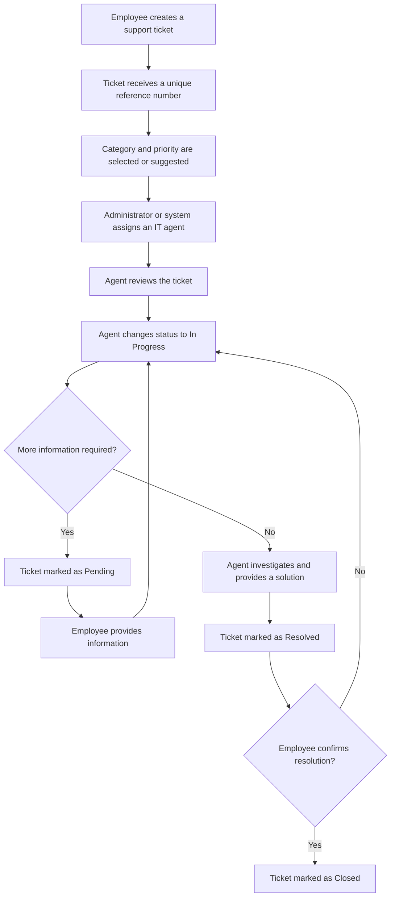
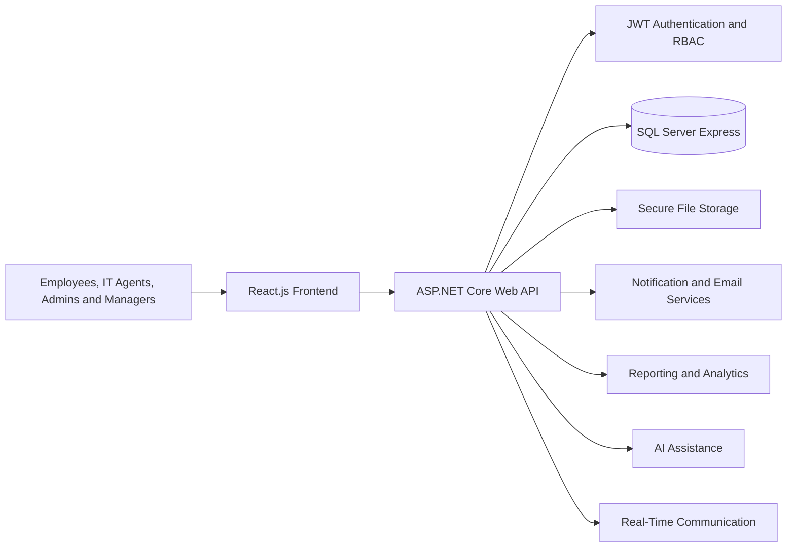

<div align="center">

# ResolveHub

### IT Help Desk & Ticketing Management System

**Create Tickets · Track Progress · Communicate · Get Resolved**

<br>


<br>

A modern full-stack platform for managing internal IT support requests through a centralized, secure, and structured ticketing workflow.

</div>

---

> [!IMPORTANT]
> ResolveHub is currently in the **planning and design phase**. The features described in this README represent the approved project scope and will be implemented incrementally.

## Table of Contents

- [Overview](#overview)
- [The Problem](#the-problem)
- [Project Objectives](#project-objectives)
- [User Roles](#user-roles)
- [Core Features](#core-features)
- [Ticket Workflow](#ticket-workflow)
- [Technology Stack](#technology-stack)
- [System Architecture](#system-architecture)
- [Database Overview](#database-overview)
- [Documentation](#documentation)
- [Quality Requirements](#quality-requirements)
- [Getting Started](#getting-started)
- [License](#license)
- [Author](#author)

---

## Overview

**ResolveHub** is a web-based IT Help Desk and Ticketing Management System designed to help organizations manage internal technical support requests efficiently.

Employees can submit support tickets, attach supporting files, track progress, communicate with IT support agents, and receive updates until their issues are resolved.

IT support agents can investigate assigned tickets, communicate with employees, update ticket statuses, add internal notes, escalate unresolved issues, and provide final solutions.

Administrators can manage users, roles, ticket categories, assignments, system settings, reports, and activity logs, while managers can monitor departmental support performance through dashboards and analytics.

---

## The Problem

Many organizations still handle technical support through:

- Scattered emails
- Phone calls
- Messaging applications
- Informal verbal requests
- Unstructured spreadsheets

This can result in:

- Lost or forgotten requests
- Slow response times
- Unclear responsibilities
- Poor communication
- Missing support history
- Limited performance monitoring

ResolveHub centralizes the complete support process into one organized platform where every request can be recorded, assigned, tracked, discussed, resolved, and reviewed.

---

## Project Objectives

ResolveHub aims to:

- Centralize internal IT support requests.
- Make ticket submission simple and accessible.
- Improve communication between employees and IT staff.
- Organize ticket assignment and reassignment.
- Prioritize urgent technical issues.
- Track every ticket from creation to closure.
- Reduce response and resolution delays.
- Preserve ticket history and audit information.
- Monitor service-level agreement deadlines.
- Provide useful dashboards, reports, and analytics.
- Support future automation using AI and real-time technologies.

---

## User Roles

| Role | Responsibilities |
|---|---|
| **Employee** | Creates tickets, uploads attachments, tracks progress, adds comments, receives notifications, reviews solutions, and closes resolved tickets. |
| **IT Support Agent** | Handles assigned tickets, investigates issues, communicates with employees, adds internal notes, updates statuses, escalates issues, and provides solutions. |
| **Administrator** | Manages users, roles, categories, priorities, statuses, assignments, reports, audit logs, settings, and overall system activity. |
| **Manager** | Monitors department tickets, unresolved issues, performance statistics, priority distribution, and authorized reports. |

---

## Core Features

### Authentication and User Management

- User registration and login using email and password
- Secure password hashing
- Password-strength validation
- Forgot-password and reset-password functionality
- JWT-based authentication
- Refresh-token management
- Role-based access control
- Protected pages and API routes
- User profile management
- Login and account activity tracking

### Ticket Management

- Create IT support tickets
- Generate a unique ticket reference number
- Add a title and detailed issue description
- Select ticket category and priority
- Upload screenshots, documents, and log files
- Edit eligible tickets
- Cancel unnecessary tickets
- Search and filter tickets
- Track creation and update dates
- Preserve the complete ticket history

### Ticket Categories

- Hardware
- Software
- Network
- Email
- Access Request
- Security
- Other

### Ticket Priorities

| Priority | Purpose |
|---|---|
| **Low** | Minor issue with limited impact |
| **Medium** | Standard issue requiring attention |
| **High** | Important issue affecting productivity |
| **Critical** | Urgent issue with major operational impact |

### Ticket Statuses

- Open
- Assigned
- In Progress
- Pending
- Resolved
- Closed
- Cancelled

### Assignment and Workflow

- Manual assignment by administrators
- Planned automatic ticket assignment
- Ticket reassignment
- Assignment history
- Status updates by support agents
- Escalation for urgent or unresolved tickets
- Internal IT-only notes
- Full audit trail of ticket actions

### Communication

- Ticket comments
- Threaded replies
- Internal support notes
- `@username` mentions
- Employee-agent communication
- Notification center
- In-app notifications
- Email notifications
- Real-time notification updates

### File Attachments

- Upload screenshots, documents, and log files
- Validate file size
- Validate supported file types
- Store file metadata
- Secure file downloads
- Prevent unauthorized attachment access
- Link attachments to tickets, comments, or chat messages

### Dashboards

#### Employee Dashboard

- Total submitted tickets
- Open tickets
- Tickets in progress
- Resolved tickets
- Recent notifications

#### IT Support Agent Dashboard

- Assigned tickets
- Tickets in progress
- Pending tickets
- High-priority tickets
- Critical tickets
- Resolved tickets
- Recent comments and updates

#### Administrator Dashboard

- Total ticket count
- Tickets by status
- Tickets by category
- Tickets by priority
- Agent workload
- Agent performance
- Recent system activity
- Monthly ticket statistics

#### Manager Dashboard

- Department tickets
- Team ticket progress
- Common issue categories
- Unresolved and delayed tickets
- Monthly reports
- Priority distribution
- Employee support activity

### Reporting and Analytics

- Monthly ticket reports
- Tickets by category
- Tickets by priority
- Average resolution time
- Agent performance
- Employee activity
- Pending and delayed tickets
- SLA violation reports
- Charts and analytics
- PDF export
- Excel export

### SLA Management

- SLA policies based on ticket priority
- First-response deadlines
- Resolution deadlines
- Countdown timers
- Deadline warnings
- SLA violation tracking
- Agent and administrator alerts
- SLA status reporting

### Audit and Activity Logs

- Login and logout tracking
- Ticket creation tracking
- Ticket assignment and reassignment tracking
- Ticket update and deletion tracking
- Administrative action tracking
- Entity and action details
- User, timestamp, IP address, and browser information

### AI-Assisted Features

- AI ticket categorization
- AI priority suggestions
- AI troubleshooting reply suggestions
- Duplicate-ticket detection
- AI ticket conversation summaries
- Confidence scoring
- Human review before accepting AI suggestions

### Real-Time Chat

- Employee-agent chat inside tickets
- Instant message delivery
- Typing indicators
- Online status
- Chat history
- File sharing
- Real-time message notifications

### QR Code Asset Management

- Register IT assets
- Generate a unique QR code for each asset
- Scan QR codes to view asset details
- Link support tickets to assets
- Track asset assignments
- Track maintenance and repair history
- Record warranties, locations, and asset status

### User Preferences

- Light and dark theme preferences
- In-app notification preferences
- Personalized account settings

---

## Ticket Workflow



### Ticket Lifecycle

```text
Open → Assigned → In Progress → Pending → Resolved → Closed
```

A ticket may also be marked as **Cancelled** when the support request is no longer required.

---

## Technology Stack

| Area | Technology |
|---|---|
| **Frontend** | React.js |
| **Backend** | ASP.NET Core Web API |
| **Database** | SQL Server Express |
| **Authentication** | JWT and Refresh Tokens |
| **Authorization** | Role-Based Access Control |
| **UI/UX Design** | Figma |
| **Database Design** | dbdiagram.io |
| **API Testing** | Postman |
| **Version Control** | Git and GitHub |
| **Documentation** | Markdown, PDF, and Notion |

---

## System Architecture



The project follows a separated full-stack architecture:

1. The **React.js frontend** provides the user interface.
2. The **ASP.NET Core Web API** handles business logic and secure API communication.
3. **JWT and role-based authorization** protect system resources.
4. **SQL Server Express** stores relational application data.
5. Supporting services handle notifications, attachments, reports, AI assistance, and real-time communication.

---

## Database Overview

ResolveHub uses a relational SQL Server database containing more than 25 connected entities.

### Main Database Areas

| Area | Main Entities |
|---|---|
| **Users and Security** | `UserAccount`, `Role`, `UserAccountRole`, `Department`, `PasswordResetToken`, `RefreshToken` |
| **Ticket Management** | `Ticket`, `TicketCategory`, `TicketPriority`, `TicketStatus` |
| **Workflow Tracking** | `TicketAssignment`, `TicketHistory`, `TicketEscalation` |
| **Communication** | `TicketComment`, `TicketMention`, `TicketChatMessage` |
| **Files and Notifications** | `TicketAttachment`, `Notification` |
| **SLA Management** | `SlaPolicy`, `TicketSlaTracking` |
| **Auditing** | `ActivityLog` |
| **Asset Management** | `Asset`, `AssetMaintenanceHistory` |
| **AI Assistance** | `AISuggestion` |
| **Preferences and Reports** | `UserPreference`, `ReportExport` |

---

## Documentation

## Documentation

The following project documentation and design artifacts are available in this repository.

| Document | Access | Description |
|----------|--------|-------------|
| **Project Overview** | **[View PDF](docs/project-overview/Project%20Overview.pdf)** | Defines the project purpose, scope, objectives, stakeholders, and overall system vision. |
| **Requirement Analysis** | **[View PDF](docs/requirement-analysis/Requirement%20analysis.pdf)** | Contains the functional requirements, non-functional requirements, business rules, and system specifications. |
| **Database Requirements** | **[View PDF](docs/database/Database%20Information%20of%20the%20project.pdf)** | Describes the database design requirements, entities, constraints, and development standards. |
| **Database Schema** | **[View PDF](docs/database/ResolveHub.pdf)** | Complete SQL Server database schema containing all tables, attributes, primary keys, foreign keys, and relationships. |
| **Entity Relationship Diagram (ERD)** | **[View ERD](docs/database/ResolveHub-ERD.png)** | Complete ERD illustrating entities, relationships, cardinalities, primary keys, and foreign keys. |
| **UI Wireframes** | **[Open Folder](docs/ui-wireframes/)** | Contains the application's interface wireframes, including dashboards, ticket management, authentication, notifications, reports, and user profiles. |
| **Workflow Diagrams** | **[Open Folder](docs/workflow-diagrams/)** | Contains system workflow diagrams covering authentication, ticket submission, assignment, resolution, administration, and AI-assisted processes. |
---

## Quality Requirements

### Usability

- Clean and modern SaaS-style interface
- Clear sidebar navigation
- Understandable buttons, forms, and labels
- Loading, error, success, and empty states
- Accessible ticket status and priority indicators

### Responsiveness

- Desktop support
- Laptop support
- Tablet support
- Mobile support

### Security

- Secure authentication
- Password hashing
- JWT session protection
- Role-based authorization
- Protected API routes
- Input validation
- Restricted ticket and attachment access
- Activity and audit logging

### Performance

- Fast dashboard loading
- Efficient search and filtering
- Optimized database access
- Reduced unnecessary API requests
- Support for multiple concurrent users

### Reliability

- Accurate ticket storage
- Preserved history after updates
- Protected comments and attachments
- Clear operation failure messages
- Complete audit information

### Maintainability

- Separation of frontend, backend, and database logic
- Reusable UI components
- Organized API structure
- Meaningful names
- Clear folder organization
- Setup and usage documentation

### Scalability

The system is designed to support future additions such as:

- More departments
- More roles
- Additional categories
- External integrations
- Advanced AI automation
- Multi-language support
- Cloud deployment
- Mobile applications

---

## Getting Started

> [!NOTE]
> The frontend and backend applications have not yet been scaffolded. Complete setup instructions will be added after the implementation begins.

### Planned Prerequisites

- Node.js
- npm
- .NET SDK
- SQL Server Express
- Git
- Visual Studio Code or Visual Studio
- Postman

### Planned Local Setup

```bash
# Clone the repository
git clone https://github.com/fatimaghannam/ResolveHub.git

# Open the project folder
cd ResolveHub
```

Frontend, backend, database configuration, migration, and execution commands will be documented as each application layer is created.

---

## License

This project is licensed under the [MIT License](LICENSE).

---

## Author

### Fatima Ghannam

Computer Science Student  
Full-Stack Development Intern  
Summer Internship Project — 2026

[](https://github.com/fatimaghannam)

---

<div align="center">

### ResolveHub

**Support Beyond Resolution**

Built with dedication as part of the 2026 Full-Stack Development Internship.

</div>