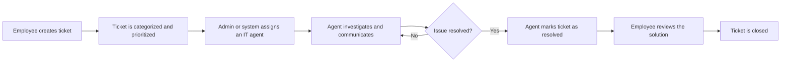
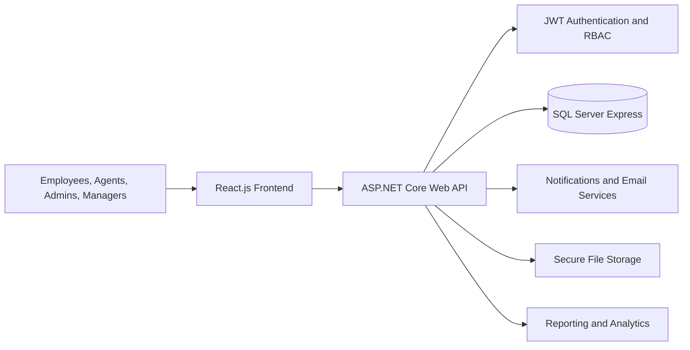

# ResolveHub
Modern IT Help Desk &amp; Ticketing Management System built with React, ASP.NET Core, and SQL Server.
<div align="center">

# ResolveHub

### IT Help Desk & Ticketing Management System

A full-stack web application for organizing, assigning, tracking, and resolving internal IT support requests.


</div>

> **Project status:** ResolveHub is currently in the planning and design phase. Features described below represent the approved project scope and will be implemented incrementally.

---

## Overview

**ResolveHub** is a modern, web-based IT Help Desk and Ticketing Management System designed to help organizations manage internal technical support requests in a structured, transparent, and efficient way.

Instead of relying on scattered emails, phone calls, or messaging applications, employees can submit support tickets through one centralized platform. IT support agents can investigate and resolve issues, administrators can manage assignments and system settings, and managers can monitor team performance through dashboards and reports.

### Project Goals

- Centralize internal IT support requests.
- Improve communication between employees and the IT support team.
- Reduce response delays and missed requests.
- Track every ticket from creation to closure.
- Provide clear dashboards, reports, and audit history.
- Support future automation through SLA tracking, AI assistance, and asset management.

---

## Core Workflow



### Ticket Lifecycle

```text
Open -> Assigned -> In Progress -> Pending -> Resolved -> Closed
```

A ticket may also be **cancelled** when the request is no longer needed.

---

## User Roles

| Role | Main Responsibilities |
|---|---|
| **Employee** | Create tickets, upload attachments, track progress, communicate with support agents, receive updates, and close resolved tickets. |
| **IT Support Agent** | Manage assigned tickets, investigate issues, add comments or internal notes, update statuses, request information, escalate issues, and provide solutions. |
| **Admin** | Manage users, roles, categories, priorities, statuses, assignments, reports, settings, activity logs, and overall system operations. |
| **Manager** | Monitor department tickets, review unresolved or delayed requests, analyze performance, and export authorized reports. |

---

## Planned Features

### Authentication and Access Control

- Email and password registration and login.
- Password hashing and password-strength validation.
- Forgot-password and reset-password workflows.
- JWT-based session management.
- Role-based access control for employees, agents, admins, and managers.
- Protected pages, API routes, tickets, and attachments.
- User profile management and account activity tracking.

### Ticket Management

- Ticket creation with a unique reference number.
- Categories such as Hardware, Software, Network, Email, Access Request, Security, and Other.
- Priorities: Low, Medium, High, and Critical.
- Search, filtering, editing, and cancellation.
- Assignment and reassignment history.
- Status and change history.
- Escalation for urgent or unresolved requests.
- Internal IT-only notes.
- Secure file attachments.

### Communication and Notifications

- Ticket comments and threaded replies.
- `@username` mentions.
- In-app notification center.
- Email notifications for important ticket events.
- Real-time notification updates.
- Planned real-time chat with typing indicators, online status, history, and file sharing.

### Dashboards and Reporting

- Role-specific dashboards for employees, agents, admins, and managers.
- Ticket statistics by status, category, and priority.
- Agent workload and performance views.
- Average resolution-time reporting.
- Pending, delayed, and SLA-violation reports.
- Report export to PDF and Excel.

### Advanced Capabilities

- SLA response and resolution countdowns.
- Audit logs for important user, ticket, and administrative actions.
- AI category and priority suggestions.
- AI-assisted replies and ticket summaries.
- Duplicate-ticket detection.
- QR-code-based IT asset management.
- Asset maintenance history and ticket linking.
- Theme and notification preferences.

---

## Technology Stack

| Area | Technology |
|---|---|
| **Frontend** | React.js |
| **Backend** | ASP.NET Core Web API |
| **Database** | SQL Server Express |
| **Authentication** | JWT and role-based access control |
| **UI/UX Design** | Figma |
| **ERD and Diagrams** | Draw.io / dbdiagram.io |
| **API Testing** | Postman |
| **Version Control** | Git and GitHub |
| **Documentation** | Markdown, PDF, and Notion |

---

## High-Level Architecture



The application separates the frontend, backend, and database layers to improve maintainability, testing, security, and future scalability.

---

## Database Overview

ResolveHub uses a relational SQL Server database that covers:

- Users, roles, departments, password resets, and refresh tokens.
- Tickets, categories, priorities, statuses, assignments, and history.
- Comments, replies, mentions, attachments, chat messages, and notifications.
- SLA policies, tracking, violations, and escalations.
- Activity and audit logs.
- IT assets, QR codes, and maintenance history.
- AI-generated suggestions.
- User preferences and report exports.

Database objects follow clear SQL Server naming rules, including singular **PascalCase** table names and descriptive foreign-key names such as `UserAccountID` and `TicketID`.

---

## Repository Structure

```text
ResolveHub/
├── assets/
│   ├── icons/
│   ├── images/
│   └── screenshots/
├── backend/
├── database/
├── design/
│   ├── database-schema/
│   ├── erd/
│   ├── ui-wireframes/
│   └── workflow-diagrams/
├── docs/
│   ├── api/
│   ├── architecture/
│   ├── project-overview/
│   ├── reports/
│   └── requirement-analysis/
├── frontend/
├── .gitignore
├── LICENSE
└── README.md
```

---

## Documentation

Project materials are organized in the following locations:

| Document | Repository Location |
|---|---|
| Project Overview | `docs/project-overview/` |
| Requirement Analysis | `docs/requirement-analysis/` |
| Architecture Documentation | `docs/architecture/` |
| API Documentation | `docs/api/` |
| Reports | `docs/reports/` |
| UI Wireframes | `design/ui-wireframes/` |
| Workflow Diagrams | `design/workflow-diagrams/` |
| Entity Relationship Diagram | `design/erd/` |
| Database Schema | `design/database-schema/` |

---

## Quality Goals

| Area | Goal |
|---|---|
| **Usability** | Provide a clean, modern, and understandable interface with clear navigation and feedback. |
| **Responsiveness** | Support desktop, laptop, tablet, and mobile screen sizes. |
| **Security** | Protect accounts, APIs, tickets, attachments, and sensitive actions. |
| **Performance** | Load dashboards, searches, filters, and ticket data efficiently. |
| **Reliability** | Preserve ticket history, comments, attachments, and audit information. |
| **Maintainability** | Use organized folders, reusable components, clear APIs, and meaningful names. |
| **Scalability** | Allow future departments, roles, categories, integrations, automation, and mobile support. |

---

## Roadmap

- [x] Create the GitHub repository.
- [x] Define the project scope and requirements.
- [x] Prepare the initial database requirements and schema.
- [ ] Add final workflow diagrams.
- [ ] Add final UI wireframes and design system.
- [ ] Scaffold the React frontend.
- [ ] Scaffold the ASP.NET Core Web API.
- [ ] Implement the SQL Server database.
- [ ] Implement authentication and role-based authorization.
- [ ] Implement ticket creation, assignment, and workflow.
- [ ] Implement comments, attachments, and notifications.
- [ ] Implement dashboards and reports.
- [ ] Implement SLA tracking, audit logs, AI assistance, and asset management.
- [ ] Complete testing, deployment, and final documentation.

---

## Getting Started

The application source code has not yet been scaffolded. Detailed installation and execution instructions will be added after the frontend, backend, and database projects are created.

### Planned Prerequisites

- Node.js and npm
- .NET SDK
- SQL Server Express
- Git
- Visual Studio Code or Visual Studio
- Postman

---

## License

This project is licensed under the [MIT License](LICENSE).

---

## Author

**Fatima Ghannam**  
Full-Stack Development Internship Project - 2026

[GitHub Profile](https://github.com/fatimaghannam)
